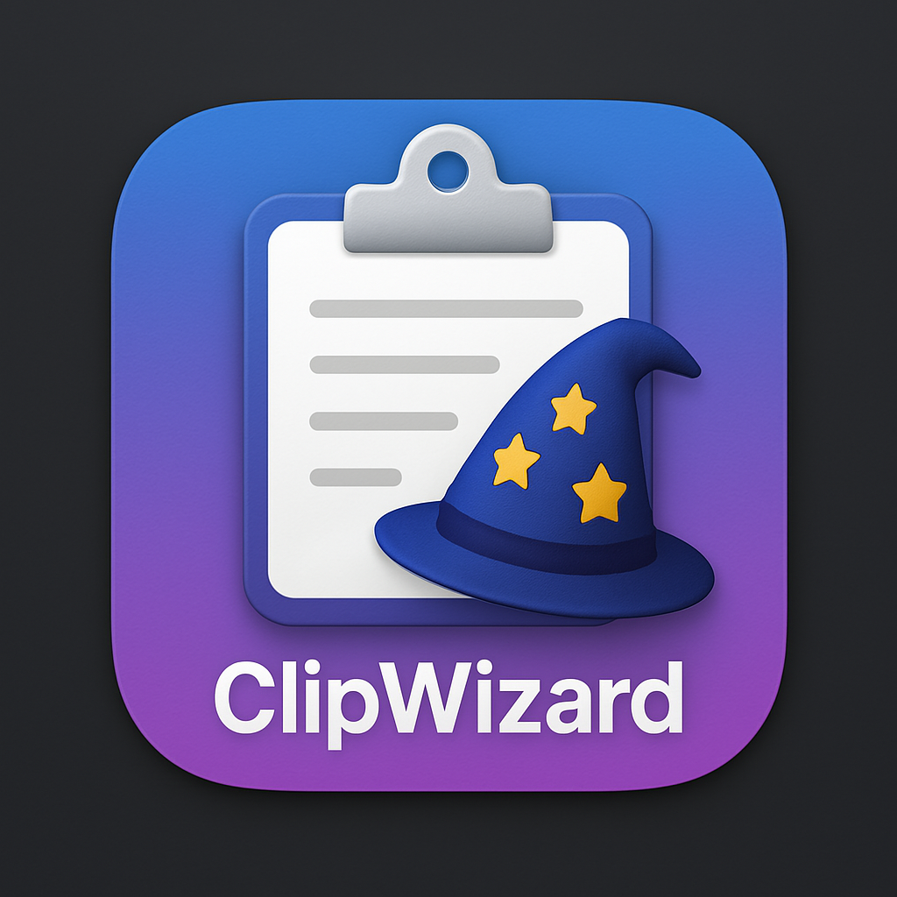
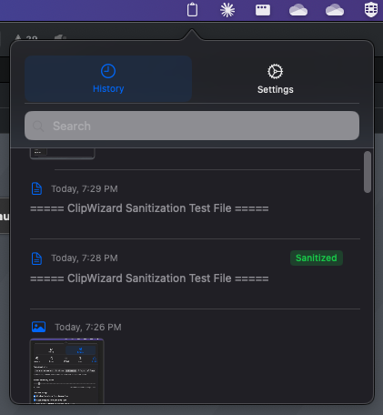
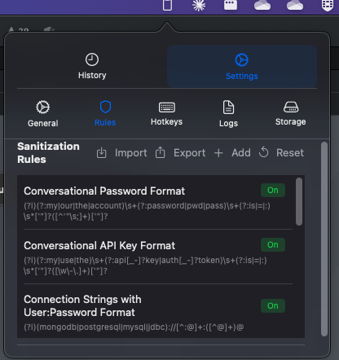

# ClipWizard

<div align="center">



**A powerful clipboard manager for macOS with advanced sanitization capabilities**

[](https://opensource.org/licenses/MIT)


</div>

## Overview

ClipWizard is a macOS clipboard manager designed for privacy-conscious users, particularly developers and IT professionals who frequently work with sensitive information. It monitors your clipboard activity, maintains a searchable history, and can automatically sanitize sensitive content like passwords, API keys, and personal information based on customizable rules.

## Key Features

### Clipboard Management

- 📋 **Persistent Clipboard History**: Never lose important copied text or images
- 🔍 **Instant Search**: Quickly find previously copied items
- 🖼️ **Image Support**: Store and preview images in your clipboard history
- 🔄 **One-Click Access**: Copy any historical item back to your clipboard with a single click

### Advanced Image Handling

- 🔎 **Smart Hover Preview**: Preview images without overlap
- ✏️ **Image Editing**: Rotate, adjust brightness and contrast
- 🎨 **Image Filters**: Apply grayscale, sepia, invert, blur, and sharpen effects
- 📝 **OCR Technology**: Extract text from images
- 💾 **Multiple Export Formats**: Save images as PNG, JPEG, TIFF, or BMP

### Privacy & Security

- 🔒 **Automatic Sanitization**: Detect and sanitize sensitive information
- 🎯 **Pattern Matching**: Use powerful regex patterns to identify sensitive content
- 🛡️ **Multiple Sanitization Methods**:
  - **Mask**: Replace with asterisks (•••••••)
  - **Rename**: Substitute with alternative values
  - **Obfuscate**: Scramble sensitive data
  - **Remove**: Completely eliminate sensitive information
- 📝 **Custom Rules**: Create and manage your own sanitization rules

### Usability

- ⌨️ **Keyboard Shortcuts**: Access features without leaving your keyboard
- 🔔 **Menu Bar Integration**: Quick access through the status menu
- ⚙️ **Customizable Settings**: Configure history size, appearance, and more

## Screenshots

### Main Window



### Rules



## Installation

### Option 1: Download the Pre-built Application

1. Go to the [Releases](https://github.com/daneb/ClipWizard/releases) page
2. Download the latest `.dmg` file
3. Open the downloaded file and drag ClipWizard to your Applications folder
4. Open ClipWizard from your Applications folder
   - **Note**: When opening for the first time, you may need to right-click the app and select "Open" to bypass macOS security restrictions

### Option 2: Build from Source

1. Ensure you have Xcode 15.0 or later installed
2. Clone this repository:
   ```bash
   git clone https://github.com/daneb/ClipWizard.git
   ```
3. Open the project in Xcode:
   ```bash
   cd ClipWizard
   open ClipWizard.xcodeproj
   ```
4. Build and run the application (⌘+R)

## Usage Guide

### Getting Started

1. After launching ClipWizard, you'll see its icon in the menu bar (top-right of your screen)
2. Click the icon to access the clipboard history and settings
3. ClipWizard will automatically start monitoring your clipboard

### Managing Clipboard History

- **View History**: Click the menu bar icon and select the History tab
- **Search**: Type in the search field to filter items
- **Copy an Item**: Click on any item in the history to copy it to your clipboard
- **Preview Images**: Hover over image items to see a preview

### Working with Images

- **Image Preview**: Click on an image item to see a detailed view
- **Edit Images**: Use the Edit tab to adjust brightness, contrast, and apply filters
- **Extract Text**: Use the OCR button to extract text from images
- **Save Images**: Click "Save Image" to export in your chosen format

### Setting Up Sanitization Rules

1. Go to the Settings tab
2. Click "Add Rule" to create a new sanitization rule
3. Enter a name, pattern (regex), and choose a sanitization method
4. Test your rule with sample text
5. Save the rule to apply it automatically to future clipboard contents

### Customizing ClipWizard

- **General Settings**: Adjust history size, startup behavior
- **Hotkeys**: Configure keyboard shortcuts for quick access
- **Appearance**: Customize the look and feel

## Troubleshooting

### Common Issues

- **No Icon in Menu Bar**: Make sure ClipWizard is running. Check Activity Monitor if unsure.
- **Clipboard Monitoring Not Working**: Ensure you've granted appropriate permissions when prompted.
- **OCR Not Working**: Text recognition works best on clear, high-contrast images.

### Logs

ClipWizard includes a comprehensive logging system to help diagnose issues:

1. Open ClipWizard
2. Go to Settings → Logs
3. Review the logs for error messages

## Privacy Statement

- ClipWizard processes all data locally on your Mac
- No clipboard data is ever sent to external servers
- No analytics or telemetry is collected

## Roadmap

### Current Development Status

- ✅ Core clipboard monitoring and history
- ✅ Sanitization engine
- ✅ Advanced image handling
- ⏳ Automated testing
- ⏳ Final UI polish

See the [PROJECT_PLAN.md](./PROJECT_PLAN.md) for detailed development status and roadmap.

## Contributing

Contributions to ClipWizard are welcome and appreciated! Here's how you can contribute:

1. **Report Bugs**: Open an issue describing the bug and steps to reproduce
2. **Suggest Features**: Have an idea? Open an issue describing your feature request
3. **Submit Pull Requests**: Want to add a feature or fix a bug yourself?
   - Fork the repository
   - Create a new branch (`git checkout -b feature/your-feature`)
   - Make your changes
   - Commit with clear messages (`git commit -m 'Add feature'`)
   - Push to your branch (`git push origin feature/your-feature`)
   - Open a Pull Request

Please read [CONTRIBUTING.md](./CONTRIBUTING.md) for detailed guidelines.

## License

ClipWizard is released under the MIT License. See the [LICENSE](./LICENSE) file for details.

## Acknowledgments

- Icon design by Grok AI
- Thanks to the SwiftUI community for resources and inspiration
- Special thanks to all contributors and beta testers

---

<div align="center">
  <em>Made with ❤️ for Mac users who value productivity and privacy</em>
</div>
